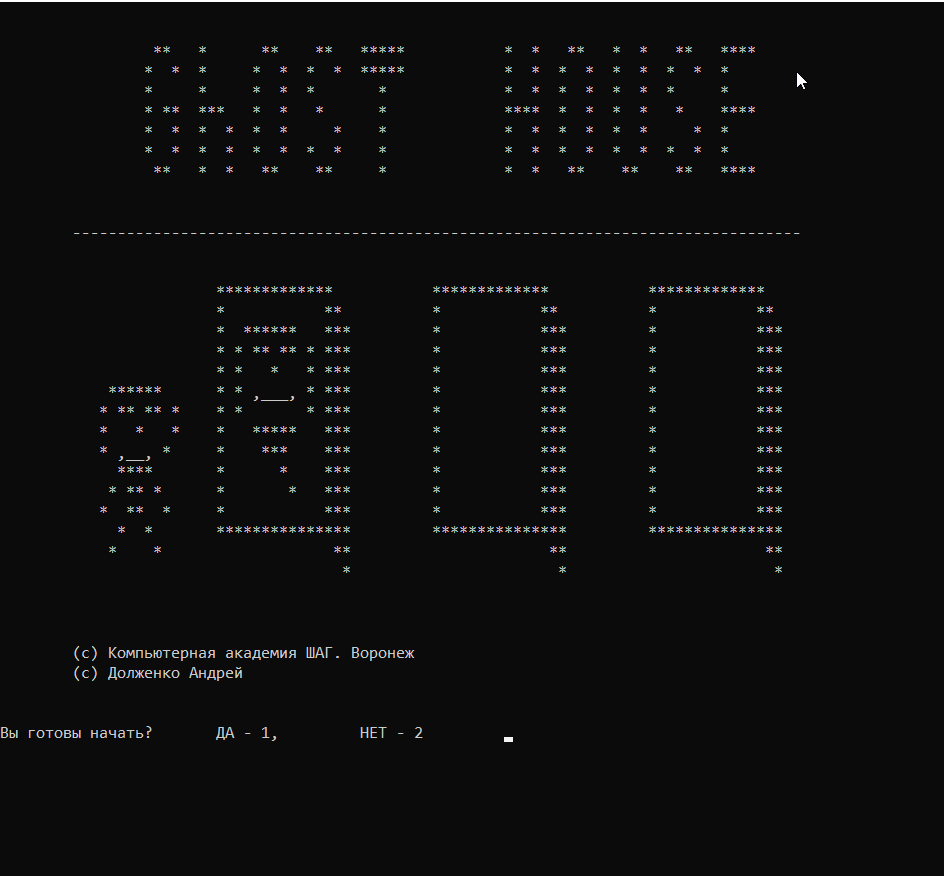
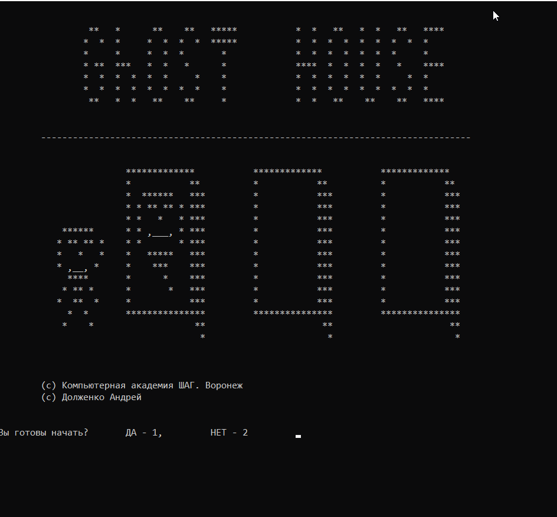
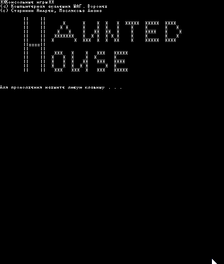
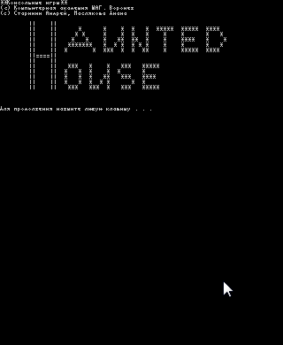

# Как мы учим в Академии. Разработка консольных игр.

Статьи впервые опубликованы в VK:
- *[Ghost House](https://vk.com/@itstepvrn-kak-my-uchim-v-akademii-razrabotka-programmnogo-obespecheniy) - https://vk.com/@itstepvrn-kak-my-uchim-v-akademii-razrabotka-programmnogo-obespecheniy*
- *[Haunted House](https://vk.com/@itstepvrn-kak-my-uchim-v-akademii-razrabotka-konsolnyh-igr-chast-2) - https://vk.com/@itstepvrn-kak-my-uchim-v-akademii-razrabotka-konsolnyh-igr-chast-2*
- *[Gost Hunter](https://vk.com/@itstepvrn-kak-my-uchim-v-akademii-razrabotka-konsolnyh-igr-chast-3) - https://vk.com/@itstepvrn-kak-my-uchim-v-akademii-razrabotka-konsolnyh-igr-chast-3*

***

## Ghost House

Сегодня хотим предложить вам познакомиться с консольными играми, которые написали студенты курса "Разработка программного обеспечения»

Начнём с первого проекта разработки игры от [Андрея Долженко](https://vk.com/id497503067).

**Ghost House (Дом с Привидениями)** — это консольная игра-угадайка, в которой нужно пройти 3 этажа и не встретиться с привидениями. Данную игру Андрей написал самостоятельно, между занятиями. На основе тех знаний, которые он успел получить в Академии. А учится он с июня 2019 г. Игра сделана в духе старых консольных игр. Используется ASCII-графика. Но от этого не становиться неинтересной. В ней есть сюжет и он лучше захватывает и затягивает, чем красивая современная графика.

Посмотрите на анимацию прохождения игры.

Ознакомиться подробнее с игрой можете в репозитории — https://github.com/itstep-vrn/GhostHouse
Если у вас есть вопросы по игре, то пишите в чат Gitter — https://gitter.im/itstep-vrn/GhostHouse# или автору на e-mail — adol2000@rambler.ru

Вот что говорит сам Андрей о своей игре:
> "По мере изучения языка программирования всегда было интересно попробовать применить навыки в прикладной задаче.
> Решение написать игру пришла в ходе обсуждения домашнего задания с Владимиром Питецким. Он подсказал идею о том, что можно не просто выполнить домашнее задание, а включить в угадайку сюжет.
> Ну а дальше подключилась фантазия. Пока продумывал варианты игры, хотел сделать ее более сложной. Например, при удачном прохождении уровня «выдавать» герою «меч» или «шлем», при этом сделать так, чтобы привидение могло появиться не в одной двери из трех, а в двух. Однако, на стадии реализации кода понял, что каждый дополнительный элемент увеличивает размер кода и проработку нюансов в геометрической прогрессии. А так как хотелось быстрее посмотреть полноценный вариант игры с окончанием и поделиться ей с товарищами, то для начала сделал самый простой вариант.
> Возможно, в дальнейшем действительно добавлю «герою» «девайсы» и сделаю игру более вариабельной.»

Немного отзывов студентов курса и знакомых Андрея.

Маслякова Диана:
> Какая Милая игра получилась)) дам дочкам поиграть

Питецкий Владимир:
> "Фига се ты) Крутецки получилось!...Классное визуальное оформление...круто было бы если бы в конце ты сделал возможность начать с начала)"

Кошелев Алексей:
> "прикольно так! молодец!!вспомнил времена денди !"

Гузоева Софият:
> "Забавная простая игрушка «из моего детства», чем-то похожа на ролевую. Может затянуть, ведь спасти принцессу хочется, во что бы то ни стало!»

Это только одна игра. Следите за новостями, скоро будут ещё игры.

## Haunted House

Продолжаем вас знакомить с консольными играми, которые написали студенты курса "Разработка программного обеспечения»

Продолжим проектом игры от [Масляковой Дианы](https://vk.com/id1151140). Да, у нас учатся и девушки, как бы многих это не удивило. Да, девушек не так много учится, как хотелось бы. Но они во многих вещах обходят мужскую половину учащихся.

**Haunted House** — игра, в которой нужно выбраться из подвала дома с привидениями. Нужно выбраться из подвала дома с привидением. Каждая дверь открывается путем отгадывания загадки, написанной на двери. Ответом на каждую загадку будет число, которое нужно ввести. Есть три попытки около каждой двери. Если число введено верно, то игрок проходит дальше. И в конце концов выйдет из дома. Если число введено неверно, то на игрока нападает привидение и он остается в доме.

Давайте посмотрим как можно пройти эту игру.

Ознакомиться подробнее с игрой можете в репозитории — https://github.com/itstep-vrn/HauntedHouse
Если у вас есть вопросы по игре, то пишите в чат Gitter — https://gitter.im/itstep-vrn/HauntedHouse#

Вот что пишет Диана о своей игре:
>На одном из занятий было дано домашнее задание написание кода для игры "Дом с привидениями". Увлекшись другими заданиями, не было времени приступить к нему сразу, а Андрей Долженко шустро написал игру и скинул нам для тестирования. Меня это очень вдохновило, потому что очень здорово у него получилось! Особенно это впечатляюще, потому что проучились мы совсем немного, а уже можно создать простые игры. Поэтому стала размышлять какие ещё возможны варианты реализации данной игры. И пришла идея, чтобы двери открывались от введенного кода, а код будет являться ответом на загадку, которая написана на двери. Таким образом игра стала не просто развлекающей,но и развивающей!

Немного отзывов по игре.

Анатолий Зиновьев:
> «Классная игра, на некоторые вопросы очень сложно было ответить, нужно разбираться в разных системах счисления и иметь математический склад ума. Креативная идея и неожиданный конец. В целом удивила и понравилась. Желаю творческих успехов автору.»

Андрей Долженко:
> Интеллектуальная игра-квест. Чтобы выбраться из дома нужно поломать голову. Особенно страшно, когда "щелкая мышкой и стуча по клавиатуре, на Вас надвигается привидение..." Попробуй тут не пройди!

Следите за новостями, скоро будут ещё игры.

Продолжение следует…

Напоминаем, что проекты студентов Академии вы можете посмотреть на GitHub'е — https://github.com/itstep-vrn

## Gost Hunter

Продолжаем вас знакомить с консольными играми, которые написали студенты курса «Разработка программного обеспечения».

Продолжаем проектом игры [Питецкого Владимира](https://vk.com/wingofnight).

**Gost Hunter** - это текстовая РПГ, где вам придётся скитаться по комнатам замка и сражаться с разного рода «нечестью».

Ужасная принцесса похитила дракона и ставила на нем эксперименты, из за чего все жители замка преобразились. Находите полезные вещи, прокачивайтесь и принимайте не легкие решения. От вашего выбора зависит прохождение.

Ознакомиться подробнее с игрой можете в репозитории — https://github.com/itstep-vrn/GhostHunter

Если у вас есть вопросы по игре, то пишите в чат Gitter — https://gitter.im/itstep-vrn/GhostHunter или или автору на e-mail — wingofnight777@gmail.com

Вот что говорит сам Владимир о своей игре:
> Получив задание сделать игру про три двери, в моем воображении взорвалась бомба, я просто не успевал за течением мыслей, которые описывали усовершенствованные возможности игры. Каждую секунду появлялись новые элементы. Оставался вопрос, как реализовать задумку используя имеющиеся навыки.Сперва надо было продумать интерфейс, что будет видеть пользователь. Используя опыт первых разработчиков, которые применяли графику в консоли, и делали коридорные игры, я остановился на выборе рисунка статичной комнаты, с некоторыми динамическими элементами. Такими как монстры и сундук. Они появляются в массиве рисунка, заменяя некоторые элементы иными символами.Сундук должен был давать рандомный предмет, на подобии современных "лутбоксов". Но! Так же я добавил возможность не получить ни чего.
> Бой с монстрами я организовал в функции которая взаимодействует с здоровьем игрока и его атрибутами. Так же я добавил возможность боя с двумя монстрами сразу. После успешной битвы игрок получает опыт, и иногда предмет или ключ от сундука.
> Создавая игру я много рисовал и делал пометок на бумаге. Изображения монстров, карта уровня. Каждая комната была описана за долго до ее создания. А так же западные и восточные комнаты должны были отличатся окном и не возможностью "выйти" в тупик.Так же был продуман интерфейс инвентаря, так как игрок должен видеть свое имущество, опыт, здоровье и координаты. Некоторые предметы можно использовать в процессе сражения с монстром, такие как аптечка или магический свиток. Набирая опыт, игрок получает уровни, которые в свою очередь открывают способности. Способности в бою дают сильное преимущество, не расходуют Ману. Ах да, совсем забыл. Для интереса я ввел два класса, выбор которого игрок может сделать в самом начале. А так же ввести свое имя, что бы игра обращалась к нему по имени. Я добавил режим администратора, добавив чит, при вводе имени "satan" - игроку давалось много здоровья, маны, высокий уровень и ключи. Так же выбор класса влияет не стартовые параметры, некоторые предметы дают разные бонусы в зависимости от класса, а NPC относятся к игроку по разному. Если он маг, могут дать совет, если воин...ну, тоже что ни будь дают.
> Финальный босс ещё в разработке…

Следите за новостями, скоро будут ещё игры, ведь у нас запустилась новая группа курса «Разработка программного обеспечения»

Продолжение следует…

Напоминаем, что проекты студентов Академии вы можете посмотреть на GitHub'е — https://github.com/itstep-vrn
