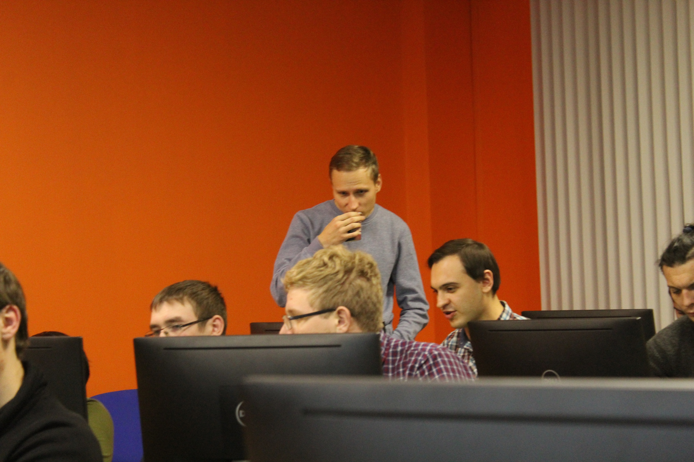
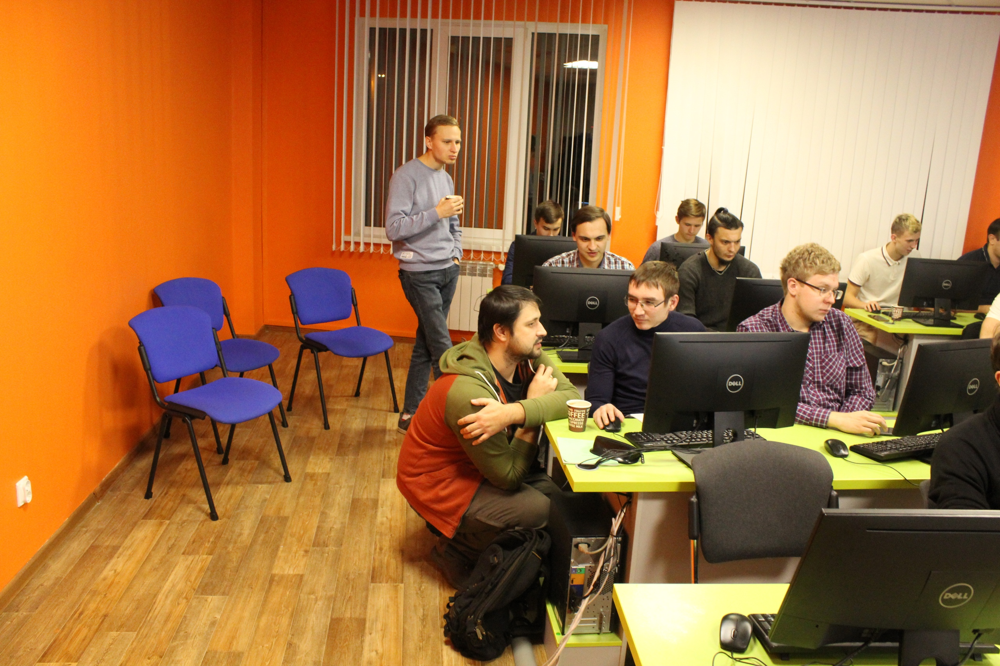
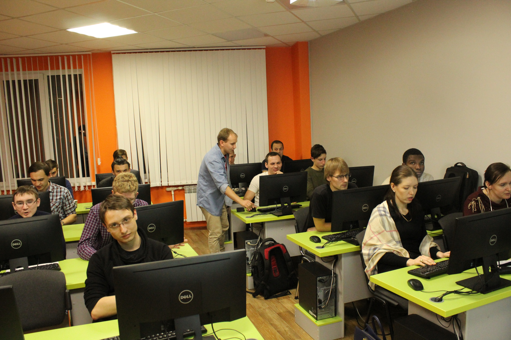
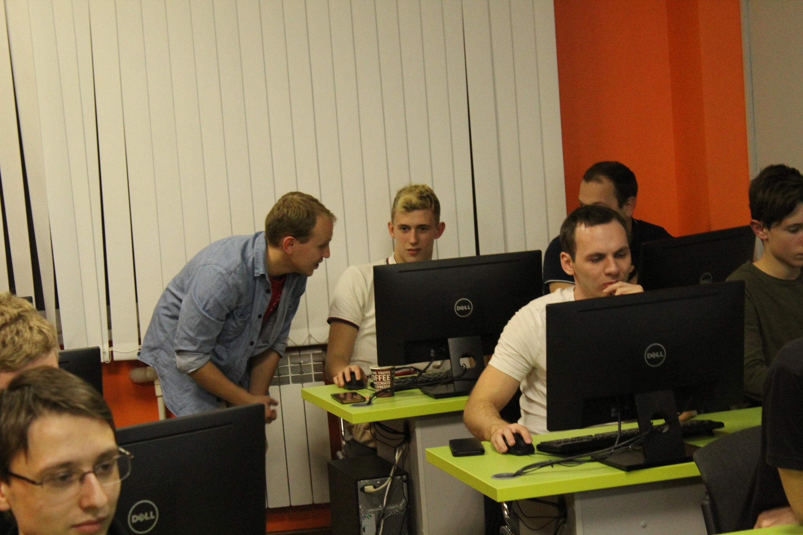

# Как мы учим в Академии. Наставничество. Часть 1.

*[Статья впервые опубликова в VK](https://vk.com/@itstepvrn-kak-my-uchim-v-akademii-nastavnichestvo-chast-1) - https://vk.com/@itstepvrn-kak-my-uchim-v-akademii-nastavnichestvo-chast-1*

***

В нашей Академии много групп факультета РПО (разработка программного обеспечения). По прошествии нескольких месяцев многие студенты показывают хорошие результаты не только в программировании, но и в помощи освоения программирования своим сокурсникам.

Исходя из этого решил применить их педагогические навыки в других группах. Так и родился проект наставничества на факультете РПО. Было предложено студентам попробовать себя в роли наставника. И они, как это ни странно, охотно согласились. Причём плюсы наставничества тоже сами привели. Мне оставалось только порадоваться за них.

Итак, что же такое наставничество в нашей Академии? Это проект, призванный помочь новым студентам с освоением учебной программы. Но плюсы здесь для обеих сторон:
— наставники повторяют пройденный материал
— повышается самооценка у наставников, следовательно желание повышать свою квалификацию
— студенты могут спросить у «себе подобных» студентов без сильного стеснения, всё-таки иногда они стесняются спрашивать у преподавателя
— повышается количество студентов, которым можно объяснить темы в единицу времени, можно сразу нескольким студентам уделить внимание
— и другие «плюшки»…

Для знакомства новых студентов с наставниками решил пригласить их на занятие, чтобы они помогали мне в проведении. Эффект от этого оказался… Для меня превзошёл все ожидания. Наставники помогали мне охватить сразу несколько студентов, помочь им с объяснением. А студенты могли не ждать своей очереди очень долго.

Мнение наставников и студентов.

Саранцев Дмитрий:
> Забавно, но интересно, стесняются многие, не понимают и молчат. Лучше сам понимать начинаешь, когда объяснить другому пытаешься.
> Вспомнил анекдот.
> > Разговор 2-х преподавателей:
> > - Ну и группа мне в этом году попалась тупая!
> > - А что так?
> >- Представляешь себе, объясняю теорему - не понимают! Объясняю второй раз - не понимают!! В третий раз объясняю. Сам уже понял. А они не понимают…

Рязанцев Илья
> С наставниками конечно проще, мне помогли ребята, буду с парнями консультироваться, хорошая была идея

Это было только начало. Следите за следующими статьями.
