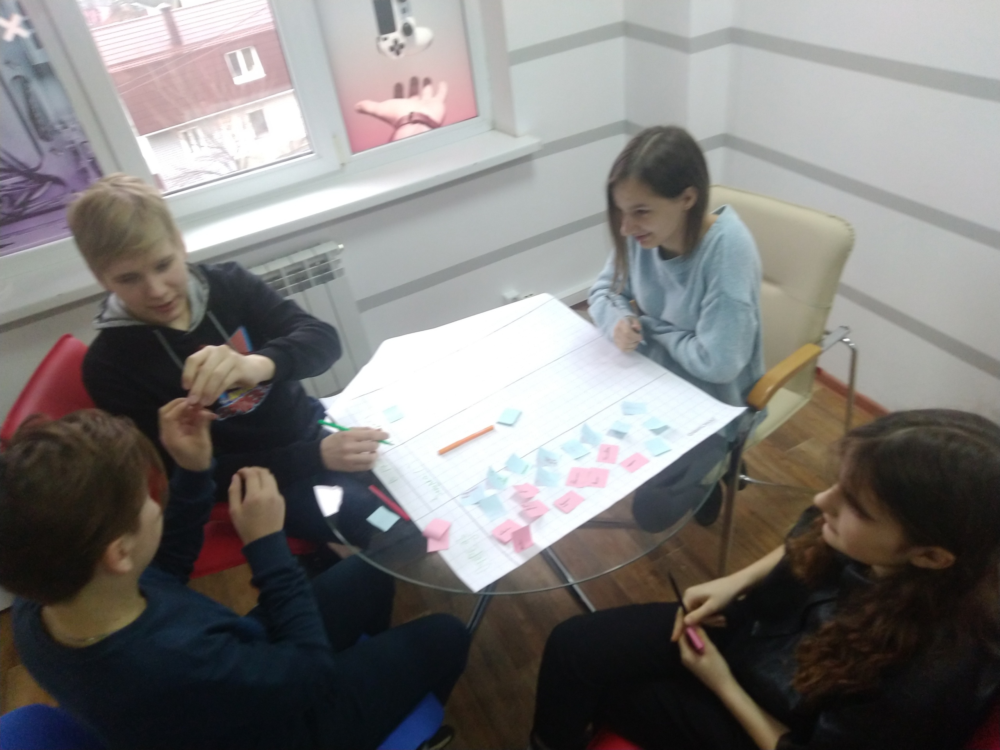
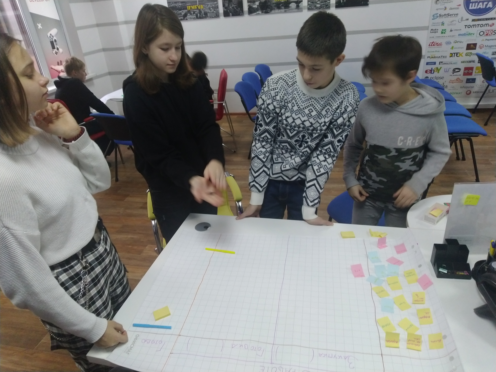
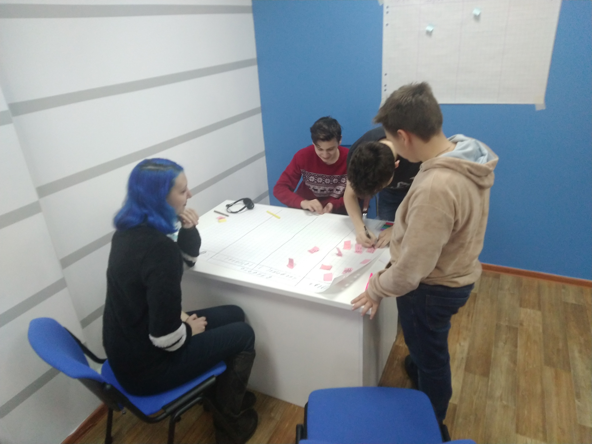
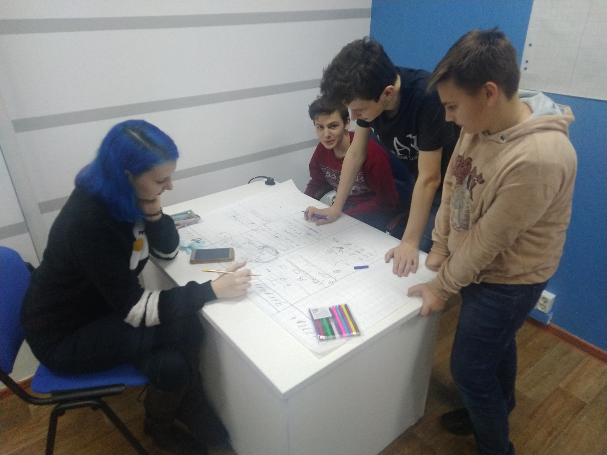
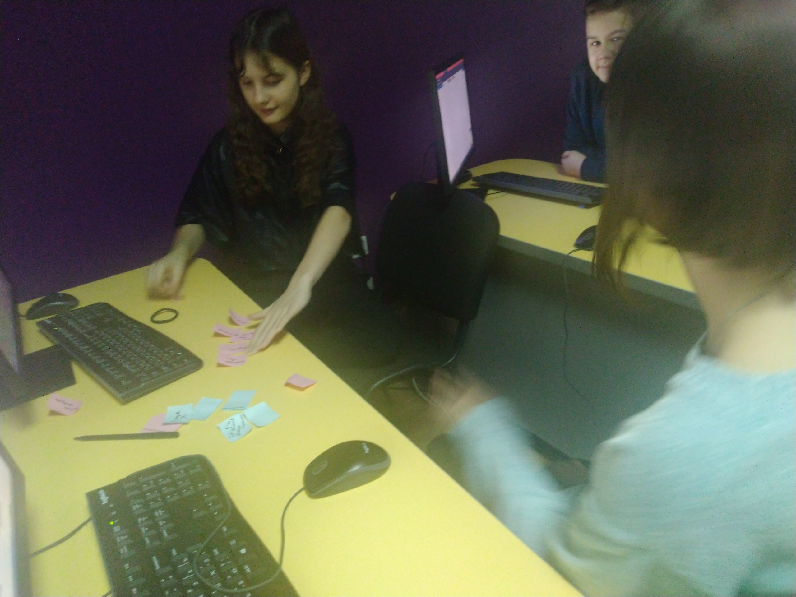
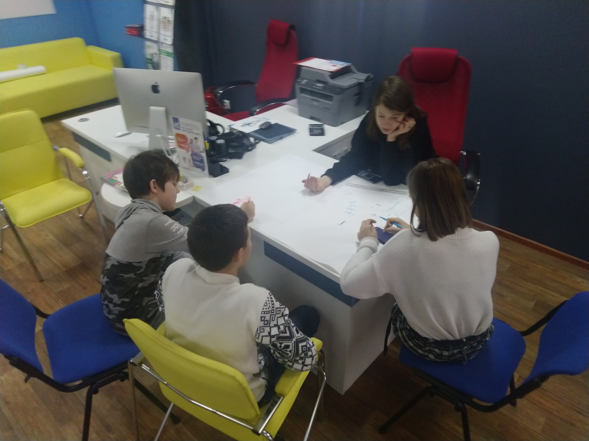

# Как мы учим в Академии. Командная разработка игр в "Малой компьютерной академии".

*[Статья впервые опубликова в VK](https://vk.com/@itstepvrn-kak-my-uchim-v-akademii-komandnaya-razrabotka-igr-v-maloi-ko) - https://vk.com/@itstepvrn-kak-my-uchim-v-akademii-komandnaya-razrabotka-igr-v-maloi-ko*

***

Сейчас расскажу вам о том, как дети изучают не просто «компьютерные науки», а ещё и учатся командной работе.

Подготовка к разработке игры в блокe «Game Development. Junior» прошла с игры FeatureBan (почитать об игре — https://filipyev.ru/2018/03/28/featureban-prostaya-igra-simulyaciya-kanban/). Дети познакомились с азами командной работы, с плюсами и «подводными камнями».

После тренинга команды приступили к разработке своей будущей игры, которую должны будут представить в качестве финального проекта пройденного блока.

Но что очень удивляет, так это то, с какой серьёзностью они подошли к проектированию и разработке игры. У каждой команды «мозговые штурмы», выделение ролей, планирование и многое другое. Почему такого образования не было в моё детство?.. За этим процессом очень интересно наблюдать. Главное не вмешиваться. Подсказать да, но не делать за них.

Да, это подростки, которые через несколько лет уже вступят во взрослую жизнь. И у них есть возможность многое попробовать сейчас, понять как нужно себя вести, что такое работа и для чего нужно образование.
