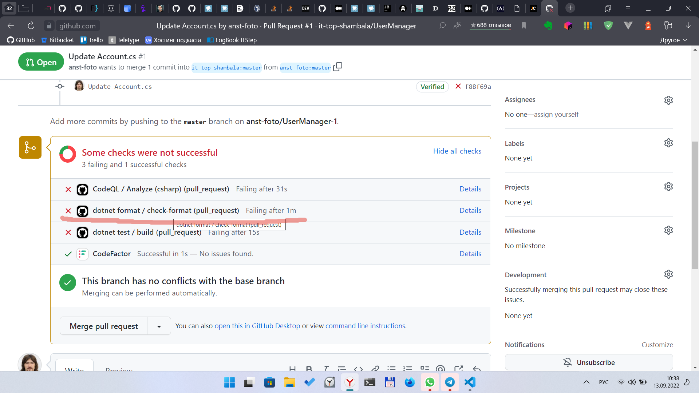
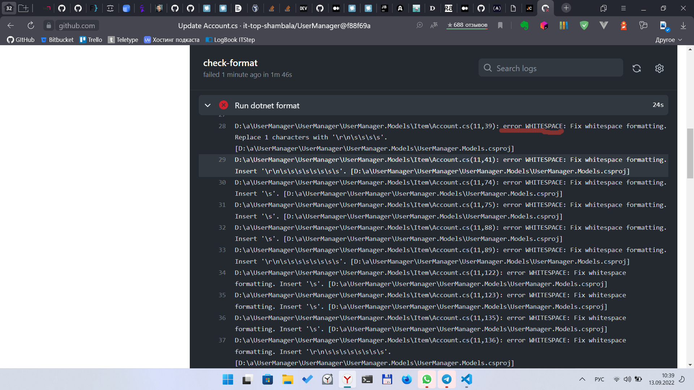

# Использование GitHub в обучении студентов. Автоматизация проверок. Часть I.

В конце декабря 2020 года я написал несколько статей на Хабре по своему опыту использования GitHub в обучении студентов (ссылки на них будут в конце сей статьи).

Сегодня же хочу рассказать об автоматизации проверки кода студентов. Примеры будут про C#, т.к. это мой основной язык, на котором я преподаю программирование.

Для меня при обучении программированию важно, чтобы студенты умели не только правильно решать задания, но и красиво писать код. В обучении и проверки заданий я использую **EditorConfig**, **dotnet cli** и **GitHub Actions**. Но обо всём по порядку.

## EditorConfig

Для C# существуют различные рекомендации по стилю кода, по именованию. Например:
- https://docs.microsoft.com/ru-ru/dotnet/csharp/fundamentals/coding-style/coding-conventions
- https://google.github.io/styleguide/csharp-style.html

Подробно о стилевых особенностях останавливаться не буду. Они могут разниться в командах, да и кому как удобнее. Плюс правил очень много.

Для формализации описания правил использую файл `.editorconfig`, как сказано в документации Microsoft. За основу взял [файл из примера](https://docs.microsoft.com/ru-ru/dotnet/fundamentals/code-analysis/code-style-rule-options?view=vs-2019#example-editorconfig-file) и немного его дополнил. Вот мой [файл `.editorconfig` для C#](https://github.com/anst-foto/dot_files/blob/master/EditorConfig/csharp_4.editorconfig). Сей файл помещается в корень решения. Это необходимо чтобы правила оформления применялись для всего решения. При этом не важно в какой IDE вы пишите код, **EditorConfig** поддерживается многими редакторами и средами разработки. Подробнее о поддержке редакторами и формате файла можете почитать на [оф. сайте **EditorConfig**](https://editorconfig.org/).

## `dotnet format`

Для ручной проверки написанного кода на соответствие правил оформления можно использовать команду `dotnet format`. Подробнее о команде можно узнать из [оф. документации Microsoft](https://docs.microsoft.com/ru-ru/dotnet/core/tools/dotnet-format). К тому же она умеет и автоматически исправлять и приводить код в соответствии с правилами в `.editorconfig`. Но мне это не нужно для проверки заданий от студента. Наоборот нужно получить только отчёт об оформлении кода. Поэтому я использую команду со следующими ключами: `dotnet format --no-restore --verify-no-changes`

## GitHub Actions

Вручную проверять конечно хорошо, но мне необходимо автоматизировать это действие. Для этого я буду использовать **GitHub Actions**. Сей инструмент/сервис от GitHub очень мощный и позволяет много чего автоматизировать. Я буду использовать только маленькую толику его возможностей. Почитать подробнее об GitHub Actions можно в [официальной документации](https://docs.github.com/en/actions/using-workflows/about-workflows) или в различных статьях, например в [этой статье](https://cakeinpanic.medium.com/github-actions-%D0%B1%D0%B0%D0%B7%D0%B0-2501445e7392).

## Порядок действий

1. Для начала необходимо задание залить в репозиторий на GitHub.
2. После этого нужно объяснить студентам что сдают они задние через `pull request` из своего форка. Подробнее о таком способе работы у меня написано [здесь](https://habr.com/ru/post/534198/).
3. Добавляете в корень репозитория файл `.editorconfig` с вашим набором правил.
4. Создаётся файл формата **YAML** `dotnet-format.yml` для проверки кода на соответствие code style. Файл должен находиться по следующему пути: `./.github/workflows/` (в корне проекта создаётся папка **.github**, а в ней подпапка **workflows**). Содержимое файла приведено ниже.

```yaml
name: dotnet format
on:
  pull_request:
    branches: [ "master" ]

  jobs:
  check-format:
    runs-on: windows-latest
    
      steps:
      - name: Setup .NET Core
        uses: actions/setup-dotnet@v2
          with:
          dotnet-version: '6.0.x'
       
        - name: Check out code
        uses: actions/checkout@v3
       
        - name: Run dotnet format
        run: dotnet format --no-restore --verify-no-changes
```

Если кратко, то содержимое файла описывает следующее:

- файл будет запускаться при создании запросов на слияние (pull request) в ветку master
- в виртуальной среде с Windows будет устанавливаться .NET 6
- проверка форматирования кода с выдачей отчёта

Пример вывода отчёта:





Вот так, не сильно сложно, можно упростить себе работу по проверке заданий от студентов.

Предыдущие статьи:

- [Использование GitHub в обучении студентов](https://habr.com/ru/post/533940/)
- [Использование GitHub в обучении. Примеры. Часть I](https://habr.com/ru/post/534198/)
- [Использование GitHub в обучении. Примеры. Часть II](https://habr.com/ru/post/534292/)
- [Использование GitHub в обучении. Примеры. Часть III](https://habr.com/ru/post/536590/)
