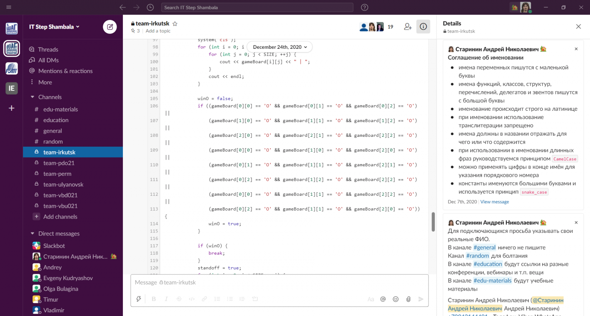
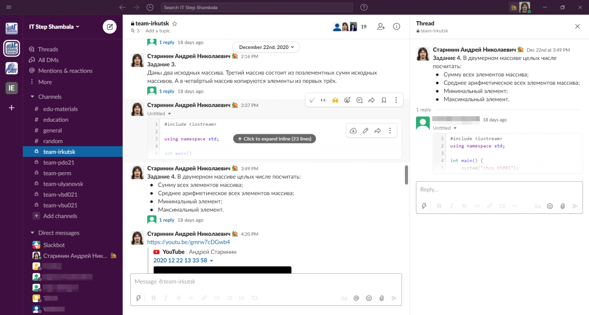
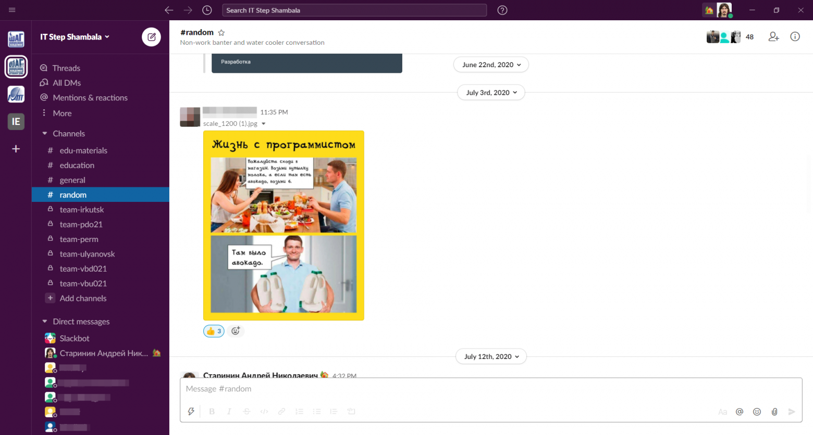

# Использование Slack в обучении

*Статья впервые опубликована на портале Хабр - https://habr.com/ru/post/536598/*

***

Если кто вдруг не знает, то Slack - это корпоративный мессенджер с поддержкой каналов, видеовстреч, интеграций с другими сервисами. Подробнее можно почитать в [Wikipedia](https://ru.wikipedia.org/wiki/Slack) или на [оф. сайте](https://slack.com/intl/en-ru/).

Но прежде хочу рассказать о минусах.

### Чем мне не нравится Slack

- Платная подписка. По началу думал что бесплатного тарифа хватит ([подробнее о тарифах](https://app.slack.com/plans/)).

    - Но примерно через год активного использования - закончилось бесплатное место и количество сообщений. Нужно переходить на использование облачных хранилищ.
    - Невозможность делать групповые звонки в бесплатном тарифе.

    *Знаю, что есть тариф для учебных заведений, но я так и не смог разобраться что нужно, чтобы его оформить. [Подробнее о тарифе для учебных заведений](https://slack.com/intl/en-ru/help/articles/206646877-Apply-for-the-Slack-for-Education-discount).*

- **UPD. Теперь уже есть русификация.** ~~Отсутствие русификации. Не хватает русскоязычной документации.~~
*Я не против изучения английского языка. И понимаю что он очень необходим в IT-сфере, но не всегда люди могут одновременно изучать программирование и английский язык или владеть им уже.*

### Почему я стал использовать Slack в обучении?

- Можно разграничить каналы по типу записей в них. Закрытые для общения внутри групп, открытые для общего общения и для наполнения справочными материалами или публикацией важных новостей и объявлений.
    

    Правда сложно сразу сделать правильную, удобную систему каналов. Но со временем получилось.

    Примерный список каналов
    - канал #general необходим для сообщений учебной части и руководства
    - канал #random для болтания
    - в канале #education будут ссылки на разные конференции, вебинары и т.п. вещи
    - в канале #edu-materials-prog будут учебные материалы
    - каналы #team-<номер группы> - это закрытые каналы групп студентов

    Прекрасно понимаю, что не самая лучшая система каналов, но пока остановился на такой.

- Личные сообщения никто не отменял.

- Удобно вставлять код программ, он сразу подсвечивается.

- Можно фиксировать/закреплять необходимые сообщения. На скриншоте к предыдущему пункту справа видны как раз закреплённые сообщения.

- Удобно вести беседы на определённые темы. Есть система комментариев к сообщениям.

- Можно оставлять не только комментарии к сообщениям, но и своё отношение в виде эмодзи/смайликов

- Можно интегрировать различные сервисы. Я чаще всего интегрирую GitHub, Trello. Для меня очень удобно, когда из одной программы можно сделать карточку в Trello и посмотреть кто куда и что запушил на GitHub

